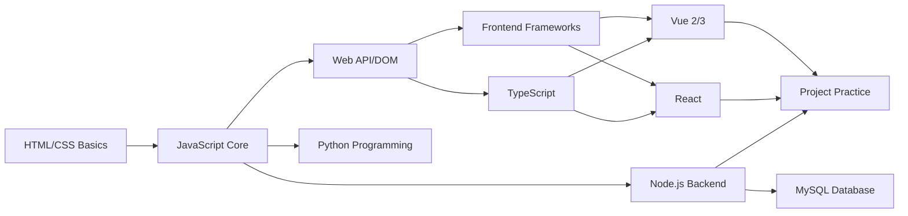

# Directory <Badge type="tip" text="Index" />

> [!NOTE]
> Below is the complete content directory of DevCrafter Blog, click links to jump quickly.

## 🎯 Learning Roadmap

**Recommended Learning Order:**

1. **Phase 1: Frontend Basics** → HTML → CSS → JavaScript
2. **Phase 2: Advanced Skills** → Web API → ES6+ → Regex
3. **Phase 3: Type System** → TypeScript type-safe development
4. **Phase 4: Framework Learning** → Vue 2/3 or React
5. **Phase 5: Backend Introduction** → Node.js → MySQL
6. **Phase 6: Project Practice** → Complete project development

## 📖 Introduction

| Document | Description |
|----------|-------------|
| [Preface](/guide/preface) | Understand blog positioning, purpose, and content overview |
| [Quick Start](/guide/start) | New user guide, including usage and local development |
| [Directory](/guide/directory) | This document, complete content index |
| [About Author](/guide/about) | Author introduction and contact information |
| [Updates](/guide/updates) | Blog update records and version history |

## 🌐 Frontend Basics

### HTML

| Document | Description | Level |
|----------|-------------|-------|
| [HTML Basics](../HTML/index.md) | Tags, forms, semantics, multimedia | ⭐ Beginner |

### CSS

| Document | Description | Level |
|----------|-------------|-------|
| [CSS Basics](../CSS/index.md) | Selectors, box model, layout, animation | ⭐⭐ Basic |

### JavaScript

| Document | Description | Level |
|----------|-------------|-------|
| [JavaScript Complete Guide](../fundamentals/javascript.md) | From basics to advanced, ES6+ and async | ⭐⭐-⭐⭐⭐ |
| [Regular Expressions](../JavaScript/regex.md) | Pattern matching, form validation | ⭐⭐ Basic |

### Web API

| Document | Description | Level |
|----------|-------------|-------|
| [DOM Manipulation](../WebApi/index.md) | Element operations, events, BOM, storage | ⭐⭐ Basic |

## ⚡ Frontend Frameworks

### Vue

| Document | Description | Level |
|----------|-------------|-------|
| [Vue Complete Guide](../frameworks/vue.md) | Vue 2/3 combined, Options + Composition API | ⭐⭐⭐ Advanced |

### React

| Document | Description | Level |
|----------|-------------|-------|
| [React Basics](../React/index.md) | JSX, Hooks, Redux, Router | ⭐⭐⭐ Advanced |

### TypeScript

| Document | Description | Level |
|----------|-------------|-------|
| [TypeScript Complete Guide](../frameworks/typescript.md) | Type system, generics, TSX, practice | ⭐⭐-⭐⭐⭐ |

**Core Content:** Basic types, interfaces & type aliases, generics, advanced types, TSX with React

## 🗺️ WebGIS Development

| Document | Description | Level |
|----------|-------------|-------|
| [WebGIS Overview](../Webgis/index.md) | Map development introduction | ⭐⭐ |
| [Baidu Map](../Webgis/baidu.md) | Baidu Map JavaScript API | ⭐⭐ |
| [AMap](../Webgis/gaode.md) | AMap JS API | ⭐⭐ |
| [Tianditu](../Webgis/tianditu.md) | National Geographic Information Platform | ⭐⭐ |
| [ECharts Map](../Webgis/echarts-map.md) | Data visualization maps | ⭐⭐ |

## 🖥️ Backend Development

### Node.js

| Document | Description | Level |
|----------|-------------|-------|
| [Node Basics](../Node/index.md) | fs/http modules, Express, database connection | ⭐⭐⭐ Advanced |

## 📊 Database

### MySQL

| Document | Description | Level |
|----------|-------------|-------|
| [MySQL Basics](../MySQL/index.md) | SQL statements, CRUD operations, Node.js integration | ⭐⭐ Basic |

## 🐍 Python

| Document | Description | Level |
|----------|-------------|-------|
| [Python Basics](../Python/index.md) | Basic syntax, data structures, file operations | ⭐ Beginner |

## 📈 Data Visualization

### ECharts

| Document | Description | Level |
|----------|-------------|-------|
| [ECharts Configuration](../Echarts/index.md) | Chart configuration, data visualization | ⭐⭐ Basic |

## 🔧 Development Tools

### Git

| Document | Description | Level |
|----------|-------------|-------|
| [Git Configuration](../Git/gitSetting.md) | Installation, configuration, branch management | ⭐⭐ Basic |

## 🚀 Project Cases

| Document | Description | Tech Stack |
|----------|-------------|------------|
| [Project Cases](../Projects/index.md) | NetEase Cloud Music, e-commerce admin, etc. | Vue + Node.js |
| [Music App](../Projects/music-app.md) | NetEase Cloud Music project details | Vue + Node.js |
| [Admin System](../Projects/admin-system.md) | E-commerce admin management system | Vue + Element UI |

## 🧭 Developer Navigation

| Document | Description |
|----------|-------------|
| [Navigation Home](../Navigation/index.md) | Developer tools navigation, organized development resources |

## 📝 Changelog

| Document | Description |
|----------|-------------|
| [Change Records](../log/changelog.md) | Detailed feature updates and change history |
| [Updates](../guide/updates.md) | Blog update records and version history |

## 🌍 Multilingual Support

This blog provides Chinese and English bilingual versions:

- 🇨🇳 **Chinese** - Complete content under `/zh/` path
- 🇺🇸 **English** - Corresponding translations under `/en/` path

## 🔍 Quick Find

> [!TIP]
> Use browser search (Ctrl+F / Cmd+F) to quickly locate content

**Find by Need:**

| I want to learn... | Recommended Documents |
|-------------------|----------------------|
| Zero to hero | [HTML](../HTML/index.md) → [CSS](../CSS/index.md) → [JavaScript](../fundamentals/javascript.md) |
| Frontend job | [Vue](../frameworks/vue.md) + [Project Cases](../Projects/index.md) |
| Full-stack development | [Node.js](../Node/index.md) + [MySQL](../MySQL/index.md) |
| Data visualization | [ECharts](../Echarts/index.md) |
| Version control | [Git](../Git/gitSetting.md) |
| Find dev tools | [Developer Navigation](../Navigation/index.md) |

**Continuously updating...** 🚀
