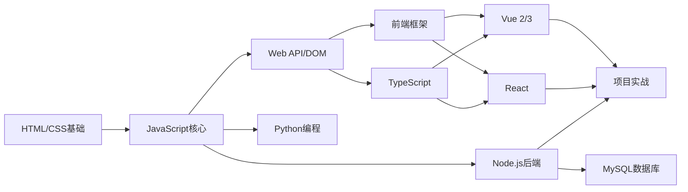

# 目录 <Badge type="tip" text="Index" />

> [!NOTE]
> 以下是 DevCrafter Blog 的完整内容目录，点击链接快速跳转。

## 🎯 学习路线图

**推荐学习顺序：**

1. **阶段一：前端基础** → HTML → CSS → JavaScript
2. **阶段二：进阶技能** → Web API → ES6+ → 正则表达式
3. **阶段三：类型系统** → TypeScript 类型安全开发
4. **阶段四：框架学习** → Vue 2/3 或 React
5. **阶段五：后端入门** → Node.js → MySQL
6. **阶段六：项目实战** → 完整项目开发

## 📖 介绍

| 文档                   | 说明                  |
|----------------------|---------------------|
| [序言](/guide/preface)   | 了解博客的定位、目的和内容概述     |
| [快速开始](/guide/start)   | 新用户入门指南，包含使用方法和本地开发 |
| [目录](/guide/directory) | 本文档，完整内容索引          |
| [关于作者](/guide/about)   | 作者介绍和联系方式           |
| [更新日志](/guide/updates) | 博客更新记录和版本历史         |

## 🌐 前端基础

### HTML

| 文档 | 说明 | 难度 |
|------|------|------|
| [HTML 基础](../HTML/index.md) | 标签、表单、语义化、多媒体 | ⭐ 入门 |

**核心内容：** 基础标签、图像超链接、表格列表、表单控件、HTML5 新特性

### CSS

| 文档 | 说明 | 难度 |
|------|------|------|
| [CSS 基础](../CSS/index.md) | 选择器、盒模型、布局、动画 | ⭐⭐ 基础 |

**核心内容：** 选择器优先级、Flex/Grid 布局、响应式设计、过渡动画

### JavaScript

| 文档 | 说明 | 难度 |
|------|------|------|
| [JavaScript 完全指南](../fundamentals/javascript.md) | 从基础到高级，包含 ES6+ 和异步编程 | ⭐⭐-⭐⭐⭐ |
| [正则表达式](../JavaScript/regex.md) | 模式匹配、表单验证 | ⭐⭐ 基础 |

**学习路径：** 基础语法 → DOM 操作 → ES6+ 新特性 → 异步编程

### Web API

| 文档 | 说明 | 难度 |
|------|------|------|
| [DOM 操作](../WebApi/index.md) | 元素操作、事件、BOM、本地存储 | ⭐⭐ 基础 |

## ⚡ 前端框架

### Vue

| 文档 | 说明 | 难度 |
|------|------|------|
| [Vue 完全指南](../frameworks/vue.md) | Vue 2/3 合并文档，选项式+组合式 API | ⭐⭐⭐ 进阶 |

**对比学习：** Vue 2 适合理解基础概念，Vue 3 是现代化开发首选

### React

| 文档 | 说明 | 难度 |
|------|------|------|
| [React 基础](../React/index.md) | JSX、Hooks、Redux、Router | ⭐⭐⭐ 进阶 |

### TypeScript

| 文档 | 说明 | 难度 |
|------|------|------|
| [TypeScript 完全指南](../frameworks/typescript.md) | 类型系统、泛型、TSX、实战 | ⭐⭐-⭐⭐⭐ |

**核心内容：** 基础类型、接口与类型别名、泛型、高级类型、TSX 与 React

## 🗺️ WebGIS 开发

| 文档 | 说明 | 难度 |
|------|------|------|
| [WebGIS 概述](../webgis/index.md) | 地图开发入门指南 | ⭐⭐ |
| [百度地图](../webgis/baidu.md) | 百度地图 JavaScript API | ⭐⭐ |
| [高德地图](../webgis/gaode.md) | 高德地图 JS API | ⭐⭐ |
| [天地图](../webgis/tianditu.md) | 国家地理信息公共服务平台 | ⭐⭐ |
| [ECharts 地图](../webgis/echarts-map.md) | 数据可视化地图 | ⭐⭐ |

## 🖥️ 后端开发

### Node.js

| 文档 | 说明 | 难度 |
|------|------|------|
| [Node 基础](../Node/index.md) | fs/http模块、Express、数据库连接 | ⭐⭐⭐ 进阶 |

**核心技能：** 文件操作、Web 服务器、RESTful API、JWT 认证

## 📊 数据库

### MySQL

| 文档 | 说明 | 难度 |
|------|------|------|
| [MySQL 基础](../MySQL/index.md) | SQL语句、CRUD操作、Node.js集成 | ⭐⭐ 基础 |

## 🐍 Python

| 文档 | 说明 | 难度 |
|------|------|------|
| [Python 基础](../Python/index.md) | 语法基础、数据结构、文件操作 | ⭐ 入门 |

## 📈 数据可视化

### ECharts

| 文档 | 说明 | 难度 |
|------|------|------|
| [ECharts 配置](../Echarts/index.md) | 图表配置、数据可视化 | ⭐⭐ 基础 |

## 🔧 开发工具

### Git

| 文档 | 说明 | 难度 |
|------|------|------|
| [Git 配置指南](../Git/gitSetting.md) | 安装配置、常用命令、分支管理 | ⭐⭐ 基础 |

## 🚀 项目实战

| 文档 | 说明 | 技术栈 |
|------|------|--------|
| [项目案例](../Projects/index.md) | 网易云音乐、电商后台等实战 | Vue + Node.js |
| [音乐 App](../Projects/music-app.md) | 网易云音乐项目详解 | Vue + Node.js |
| [后台系统](../Projects/admin-system.md) | 电商后台管理系统 | Vue + Element UI |

## 🧭 程序员导航

| 文档 | 说明 |
|------|------|
| [导航首页](../Navigation/index.md) | 程序员工具导航，分类整理开发资源 |

**导航分类：** IDE & 编辑器、编程语言、前端框架、CSS 框架、构建工具、UI 设计工具、开发工具、小程序开发、AI 工具、学习资源

## 📝 更新日志

| 文档 | 说明 |
|------|------|
| [变更记录](../log/changelog.md) | 详细的功能更新和变更历史 |
| [更新日志](../guide/updates.md) | 博客更新记录和版本历史 |

## 🌍 多语言支持

本博客提供中英文双语版本：

- 🇨🇳 **中文** - `/zh/` 路径下的完整内容
- 🇺🇸 **English** - `/en/` 路径下的对应翻译

## 🔍 快速查找

> [!TIP]
> 使用浏览器搜索功能（Ctrl+F / Cmd+F）快速定位内容

**按需求查找：**

| 我想学习... | 推荐文档 |
|------------|---------|
| 零基础入门 | [HTML](../HTML/index.md) → [CSS](../CSS/index.md) → [JavaScript](../fundamentals/javascript.md) |
| 找前端工作 | [Vue](../frameworks/vue.md) + [项目实战](../Projects/index.md) |
| 全栈开发 | [Node.js](../Node/index.md) + [MySQL](../MySQL/index.md) |
| 数据可视化 | [ECharts](../Echarts/index.md) |
| 代码版本管理 | [Git](../Git/gitSetting.md) |
| 找开发工具 | [程序员导航](../Navigation/index.md) |

**持续更新中...** 🚀
